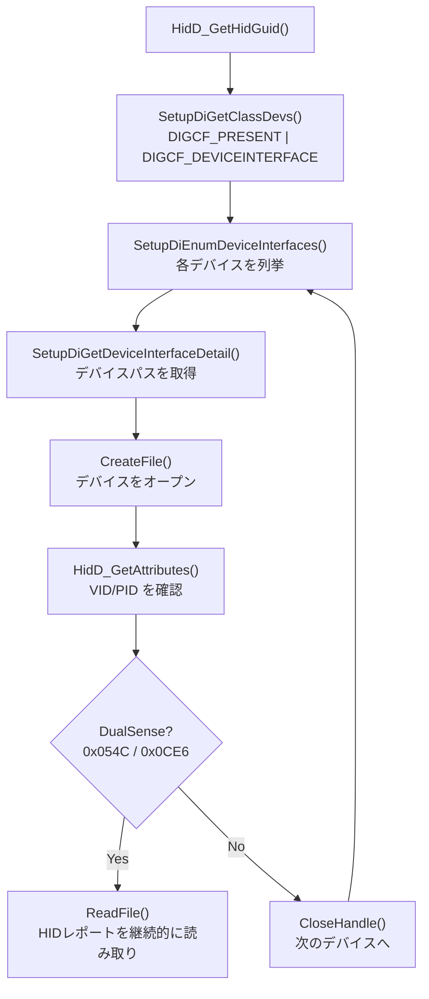
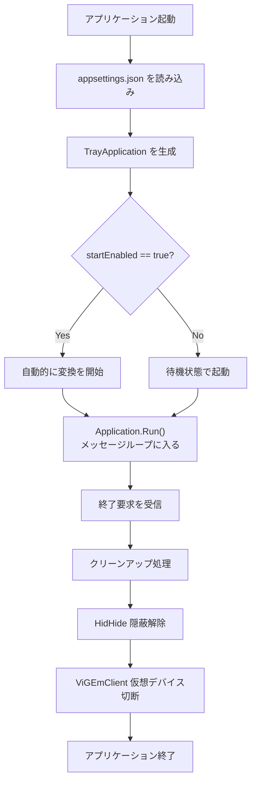
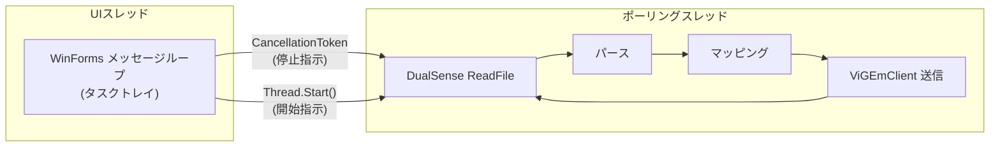
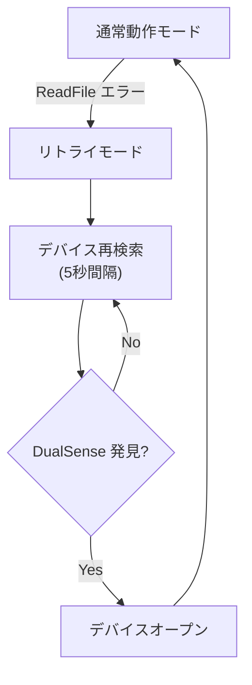

# DS4Xbox 実装詳細

## 1. プロジェクト構造

```
ds4xbox/
├── DS4Xbox.csproj          # プロジェクトファイル（ViGEmClient参照・テスト除外・InternalsVisibleTo設定）
├── Program.cs              # エントリポイント
├── appsettings.json        # 設定ファイル
├── setup_gamepad.bat       # ソースチェックアウト向け publish + 起動スクリプト
├── start_gamepad.bat       # バックグラウンド起動スクリプト
├── diagnose_gamepad.bat    # 実機・ドライバ診断スクリプト
├── open_game_controllers.bat # Windows ゲームコントローラー設定を開く確認用スクリプト
├── uninstall.bat           # [NEW] アンインストーラースクリプト
├── Native/
│   ├── HidInterop.cs       # Windows HID API P/Invoke定義
│   └── ViGEmInterop.cs     # ViGEmBus 検出・低レベル診断用 P/Invoke定義
├── Core/
│   ├── DualSenseReader.cs  # DualSense HIDレポート読み取り・パース
│   ├── InputMapper.cs      # DualSense → Xbox入力マッピング
│   ├── HidHideController.cs # HidHideCLI制御
│   ├── VirtualXboxController.cs # 公式 ViGEmClient による仮想 Xbox 360 制御
│   ├── DriverInstaller.cs  # ドライバの自動ダウンロードとセットアップ
│   ├── AppLog.cs           # 実行ログ
│   ├── DiagnosticRunner.cs # 段階診断モード
│   └── SetupForm.cs        # インストール進捗表示フォーム
├── UI/
│   ├── TrayApplication.cs  # タスクトレイUI（PNGアイコン・アンインストール機能）
│   └── Resources/
│       ├── controller_logo.png     # [NEW] ON状態用オシャレコントローラー画像（埋め込み）
│       └── controller_logo_off.png # [NEW] OFF状態用オシャレコントローラー画像（埋め込み）
├── DS4Xbox.Tests/          # [NEW] xUnit 単体テストプロジェクト
│   ├── DS4Xbox.Tests.csproj
│   └── InputMapperTests.cs
├── ds4xbox.sln             # [NEW] ソリューションファイル
└── docs/
    ├── SPECIFICATION.md     # 技術仕様書
    └── IMPLEMENTATION.md    # 実装詳細（本ファイル）
```

> [!NOTE]
> 仮想 Xbox 360 コントローラーの作成と入力送信には公式の `Nefarius.ViGEm.Client` NuGet パッケージを使用します。HID 読み取り、HidHideCLI 制御、ドライバ検出は Windows API / .NET BCL で実装しています。

## 2. Native/HidInterop.cs の実装詳細

### 使用する Windows API

| DLL | 関数 | 用途 |
|---|---|---|
| `hid.dll` | `HidD_GetHidGuid` | HID クラスの GUID を取得 |
| `hid.dll` | `HidD_GetAttributes` | デバイスの Vendor ID / Product ID を取得 |
| `hid.dll` | `HidD_GetPreparsedData` | デバイスのプリパースデータを取得 |
| `hid.dll` | `HidP_GetCaps` | デバイスの機能情報（レポート長等）を取得 |
| `setupapi.dll` | `SetupDiGetClassDevs` | デバイスクラスに属するデバイス一覧を取得 |
| `setupapi.dll` | `SetupDiEnumDeviceInterfaces` | デバイスインターフェースを列挙 |
| `setupapi.dll` | `SetupDiGetDeviceInterfaceDetail` | デバイスパスを取得 |
| `setupapi.dll` | `SetupDiDestroyDeviceInfoList` | デバイス情報リストを解放 |
| `kernel32.dll` | `CreateFile` | デバイスハンドルをオープン |
| `kernel32.dll` | `ReadFile` | HID レポートを Overlapped I/O で読み取り |
| `kernel32.dll` | `CloseHandle` | ハンドルをクローズ |

### 処理フロー



### 重要な注意点

> [!WARNING]
> `SP_DEVICE_INTERFACE_DETAIL_DATA` のマーシャリングには特に注意が必要です。32bit と 64bit で構造体のサイズが異なります：
> - **32bit**: `cbSize = 4 + 1 = 5` (DWORD + TCHAR)
> - **64bit**: `cbSize = 4 + 1 + 3(padding) = 8`
>
> `IntPtr.Size` を使って実行時に判定してください。

- `SetupDiGetClassDevs` には `DIGCF_PRESENT | DIGCF_DEVICEINTERFACE` フラグを使用すること
- `CreateFile` は `GENERIC_READ | GENERIC_WRITE`, `FILE_SHARE_READ | FILE_SHARE_WRITE` で開くこと
- `ReadFile` は Overlapped I/O で呼び出し、`WaitForSingleObject` で 100ms タイムアウトを設定すること

## 3. Core/VirtualXboxController.cs と Native/ViGEmInterop.cs の実装詳細

### 通常動作の ViGEmBus 送信

通常動作では `Nefarius.ViGEm.Client` の `ViGEmClient` を使い、公式クライアント API 経由で仮想 Xbox 360 コントローラーを作成・更新します。

```csharp
using var client = new ViGEmClient();
var controller = client.CreateXbox360Controller();
controller.Connect();
controller.SetButtonsFull(buttons);
controller.SetAxisValue(Xbox360Axis.LeftThumbX, leftX);
controller.SubmitReport();
```

これにより、ViGEmBus の内部 IOCTL や構造体差分にアプリ側が依存しません。

### 低レベル診断用 IOCTL

`Native/ViGEmInterop.cs` は ViGEmBus の存在確認と、公式クライアント経路で失敗した場合の切り分け用に残しています。診断モードでは必要に応じて既知の X360 submit IOCTL 候補（`0x803`〜`0x806` とアクセスビット差分）を試し、低レベル通信の失敗内容を表示します。

### 使用する低レベル IOCTL コード

公式 ViGEmClient ソースコード（MIT, https://github.com/nefarius/ViGEmClient）を参照して同等の IOCTL を定義します：

| IOCTL | 用途 |
|---|---|
| `IOCTL_VIGEM_CHECK_VERSION` | ドライバのバージョン確認 |
| `IOCTL_VIGEM_PLUGIN_TARGET` | 仮想コントローラーの接続（プラグイン） |
| `IOCTL_VIGEM_UNPLUG_TARGET` | 仮想コントローラーの切断 |
| `IOCTL_VIGEM_X360_SUBMIT_REPORT` | Xbox 360 入力レポートの送信 |

### デバイスパス

ViGEmBus のデバイスインターフェース GUID を使い、`SetupDiGetClassDevs()` でデバイスパスを取得し、`CreateFile()` でハンドルを開きます。

```
GUID: {96E42B22-F5E9-42F8-B043-ED0F932F014F}
```

### 入力レポート構造体 (XUSB_SUBMIT_REPORT)

```csharp
[StructLayout(LayoutKind.Sequential)]
internal struct XUSB_SUBMIT_REPORT
{
    public uint Size;           // 構造体のサイズ
    public uint SerialNo;       // ターゲットのシリアル番号
    public ushort wButtons;     // ボタンビットフィールド
    public byte bLeftTrigger;   // 左トリガー (0-255)
    public byte bRightTrigger;  // 右トリガー (0-255)
    public short sThumbLX;      // 左スティック X (-32768 ~ 32767)
    public short sThumbLY;      // 左スティック Y (-32768 ~ 32767)
    public short sThumbRX;      // 右スティック X (-32768 ~ 32767)
    public short sThumbRY;      // 右スティック Y (-32768 ~ 32767)
}
```

### 低レベル診断時の BSOD リスク軽減策

> [!CAUTION]
> カーネルドライバとの不正な通信は BSOD（ブルースクリーン）を引き起こす可能性があります。以下の対策を講じています。

- すべての `DeviceIoControl` 呼び出しを `try-catch` で保護
- バッファサイズを厳密に `Marshal.SizeOf` で計算
- 通常動作では公式 ViGEmClient API を使い、低レベル `DeviceIoControl` 送信を避ける
- 診断用 `DeviceIoControl` は Overlapped I/O を使用せず、同期モードで通信

## 4. Core/DualSenseReader.cs の実装詳細

### HID レポートのパース

64 バイト（USB）のバイト配列から以下を抽出します：

| バイト範囲 | 抽出内容 |
|---|---|
| `bytes[1-4]` | スティック軸（LX, LY, RX, RY） |
| `bytes[5-6]` | トリガー（L2, R2） |
| `bytes[8]` | ボタン群 1（D-Pad + □✕◯△） |
| `bytes[9]` | ボタン群 2（L1, R1, L2d, R2d, Create, Options, L3, R3） |
| `bytes[10]` | ボタン群 3（PS, Touchpad, Mute） |

### パース結果の構造体

```csharp
internal struct DualSenseState
{
    public byte LeftStickX;     // 0-255
    public byte LeftStickY;     // 0-255
    public byte RightStickX;    // 0-255
    public byte RightStickY;    // 0-255
    public byte L2Trigger;      // 0-255
    public byte R2Trigger;      // 0-255
    public byte DPad;           // 0-8 (Hat Switch)
    public bool Square;
    public bool Cross;
    public bool Circle;
    public bool Triangle;
    public bool L1, R1, L3, R3;
    public bool Create, Options;
    public bool PSButton;
    public bool TouchpadClick;
    public bool Mute;
}
```

### Bluetooth 対応

> [!NOTE]
> Bluetooth 接続の場合、Report ID `0x01` の簡易モードではオフセットが異なる可能性があります。実装では接続タイプ（USB/BT）を自動検出し、適切なオフセットを適用します。

検出方法:
- レポートの先頭バイト（Report ID）を確認
- `0x01` → USB または BT 簡易モード
- `0x31` → BT 拡張モード（先頭 2 バイト分のオフセットを加算）

## 5. Core/InputMapper.cs の実装詳細

### 変換処理

`DualSenseState` を受け取り、`XUSB_SUBMIT_REPORT` に変換する**純粋関数**として実装します。

```csharp
internal static class InputMapper
{
    public static XUSB_SUBMIT_REPORT Map(DualSenseState ds, uint serialNo)
    {
        // ボタンマッピング
        // 軸変換
        // Hat Switch 変換
        // → XUSB_REPORT を返す
    }
}
```

**設計方針:**
- 副作用なし（ステートレス）
- テスト容易（入力と出力が明確）
- Hat Switch の変換はルックアップテーブルで実装

### Hat Switch 変換の実装

```csharp
private static readonly ushort[] DPadMap = new ushort[9]
{
    XButtons.DPAD_UP,                              // 0: N
    XButtons.DPAD_UP | XButtons.DPAD_RIGHT,        // 1: NE
    XButtons.DPAD_RIGHT,                           // 2: E
    XButtons.DPAD_DOWN | XButtons.DPAD_RIGHT,      // 3: SE
    XButtons.DPAD_DOWN,                            // 4: S
    XButtons.DPAD_DOWN | XButtons.DPAD_LEFT,       // 5: SW
    XButtons.DPAD_LEFT,                            // 6: W
    XButtons.DPAD_UP | XButtons.DPAD_LEFT,         // 7: NW
    0                                               // 8: Released
};
```

## 6. Core/HidHideController.cs の実装詳細

### HidHideCLI のパス

```
C:\Program Files\Nefarius Software Solutions\HidHide\x64\HidHideCLI.exe
```

### 制御コマンド

| 操作 | コマンド引数 |
|---|---|
| 隠蔽 ON | `--cloak-on` |
| 隠蔽 OFF | `--cloak-off` |
| アプリ登録 | `--app-reg <実行パス>` |

### 実装方法

```csharp
internal class HidHideController
{
    private const string CliPath =
        @"C:\Program Files\Nefarius Software Solutions\HidHide\x64\HidHideCLI.exe";

    public void CloakOn()  => RunCli("--cloak-on");
    public void CloakOff() => RunCli("--cloak-off");

    private void RunCli(string args)
    {
        var psi = new ProcessStartInfo(CliPath, args)
        {
            CreateNoWindow = true,
            UseShellExecute = false
        };
        Process.Start(psi)?.WaitForExit();
    }
}
```

### 異常終了時の安全策

> [!IMPORTANT]
> アプリケーションの異常終了時にも隠蔽が解除されるよう、以下のフックを登録します：

- `AppDomain.CurrentDomain.ProcessExit` → `CloakOff()` を呼び出し
- `Console.CancelKeyPress`（Ctrl+C）→ `CloakOff()` を呼び出し

これにより、どのような終了パターンでも DualSense の隠蔽が残留しないようにします。

## 7. UI/TrayApplication.cs の実装詳細

### 基本構成

- `System.Windows.Forms.NotifyIcon` を使用してタスクトレイにアイコンを表示
- `ApplicationContext` を継承してメッセージループを管理

### コンテキストメニュー項目

| 項目 | 種類 | 動作 |
|---|---|---|
| 変換 ON/OFF | チェック付きトグル | 変換の開始/停止、HidHide の切り替え |
| 起動時自動 ON | チェック付きトグル | `appsettings.json` の `startEnabled` を更新 |
| ドライバ自動セットアップ | 通常項目 | ViGEmBus / HidHide の導入支援 |
| アンインストール手順 | 通常項目 | クリーンアップ手順を起動 |
| 終了 | 通常項目 | クリーンアップ後にアプリケーションを終了 |

### アイコンの動的生成

外部ファイルに依存せず、アセンブリ内に埋め込まれたPNG画像（`controller_logo.png` / `controller_logo_off.png`）を読み込んでアイコン化します。また、読み込み失敗時に備えて動的描画のセーフティフォールバックを搭載しています：

```csharp
private static IntPtr LoadTrayIconFromResource(string resourceName, out Icon icon)
{
    try
    {
        using var stream = typeof(TrayApplication).Assembly.GetManifestResourceStream(resourceName);
        if (stream == null)
            return CreateFallbackIcon(resourceName.Contains("logo_off"), out icon);

        using var bitmap = new Bitmap(stream);
        IntPtr hIcon = bitmap.GetHicon();
        icon = Icon.FromHandle(hIcon);
        return hIcon;
    }
    catch (Exception)
    {
        return CreateFallbackIcon(resourceName.Contains("logo_off"), out icon);
    }
}
```

| 状態 | アイコンデザイン | 説明 |
|---|---|---|
| ON | 🎮 ネオンブルー・シアン（光るコントローラー） | アクティブ状態（変換処理動作中） |
| OFF | 🎮 モノトーン・グレー（消灯コントローラー） | 非アクティブ状態（変換処理停止中） |

## 8. Program.cs の実装詳細

### 起動シーケンス



### エントリポイントのコード構造

```csharp
[STAThread]
static void Main()
{
    // 1. 設定読み込み
    var settings = LoadSettings("appsettings.json");

    // 2. 終了時フック登録
    AppDomain.CurrentDomain.ProcessExit += OnProcessExit;

    // 3. WinForms 初期化
    Application.EnableVisualStyles();
    Application.SetCompatibleTextRenderingDefault(false);

    // 4. TrayApplication 生成・実行
    using var app = new TrayApplication(settings);
    Application.Run(app);
}
```

## 9. スレッドモデル



| スレッド | 役割 | 属性 |
|---|---|---|
| UI スレッド | WinForms メッセージループ（タスクトレイ） | メインスレッド、STA |
| ポーリングスレッド | DualSense 読み取り → パース → マッピング → ViGEmClient 送信 | `Thread.IsBackground = true` |

### ポーリングスレッドの制御

- **開始**: `Thread.Start()` で新しいバックグラウンドスレッドを起動
- **停止**: `CancellationToken` を使い、安全にスレッドを停止
- **スレッド属性**: `IsBackground = true` により、メインスレッド終了時に自動的に終了

## 10. エラーハンドリング

| シナリオ | 検出方法 | 対応 |
|---|---|---|
| コントローラー未接続 | デバイス列挙で DualSense が見つからない | 接続を待機するリトライループ |
| コントローラー切断 | `ReadFile` がエラーを返す | リトライモードに遷移（再接続を待機） |
| ViGEmBus 未インストール | デバイスパスが見つからない | 起動時に通知し、セットアップ手順を案内 |
| HidHide 未インストール | CLI パスが存在しない | 警告を表示するが、変換機能自体は動作させる |

> [!WARNING]
> HidHide が未インストールの場合、変換機能は動作しますが、ゲーム側に DualSense と仮想 Xbox 360 の両方が見えるため、**二重入力**が発生する可能性があります。

### リトライモードの動作



- リトライ間隔: **5 秒**
- リトライ中も UI スレッドはブロックされない（ポーリングスレッドのみがリトライ）
- リトライ中はタスクトレイアイコンで切断状態を表示

## 11. ドライバ自動セットアップの実装詳細

### 11.1 Core/DriverInstaller.cs

外部パッケージを一切排除し、.NET 標準の `System.Net.Http.HttpClient` と Windows API `Process.Start` を組み合わせて実装されています。

*   **非同期ダウンロード**: 進捗をパーセンテージ（0-100%）で報告する `Action<int, string>` コールバックをサポートし、バックグラウンドスレッドでストリーミングダウンロードを実行します。
*   **SSL/TLS セキュリティ**: TLS 1.2 および TLS 1.3 以外の古い暗号化プロトコルを無効化し、Man-in-the-Middle (MitM) 攻撃を防御します。
*   **UAC 権限昇格の自動化**: ドライバインストーラー（MSI/EXE）を起動する際、`ProcessStartInfo.Verb = "runas"` を指定することで、Windows のユーザーアカウント制御（UAC）ダイアログを自動的に呼び出し、カーネルドライバインストールに必要な特権を取得します。

### 11.2 Core/SetupForm.cs

WinForms の標準コントロールである `ProgressBar` と `Label` のみを配置した、ダークモード調の進捗ダイアログです。

*   **スレッドセーフな UI 更新**: 別スレッド（ダウンロードタスク）から進捗が更新された場合、`InvokeRequired` と `BeginInvoke` を用いて、WinForms の UI スレッド上で安全に表示を書き換えます。

---

## 12. 単体テストの実装詳細 (DS4Xbox.Tests)

メインプロジェクトと並行して、信頼性を継続的に保証するための xUnit による単体テストを導入しています。

### 12.1 プロジェクト構成とアクセス制御
* **テスト除外設定**: メインプロジェクト `DS4Xbox.csproj` はルート階層にあるため、サブディレクトリのソースコードを自動コンパイル対象から外すための除外タグ（`<Compile Remove="DS4Xbox.Tests\**" />`）を適用しています。
* **InternalsVisibleTo 属性**: メインプロジェクト内の `internal` 修飾子が付けられた重要なロジック（`InputMapper` や `ViGEmInterop.XUSB_SUBMIT_REPORT`）をテストプロジェクトからアクセス可能にするため、`DS4Xbox.csproj` に `<InternalsVisibleTo Include="DS4Xbox.Tests" />` を定義しています。これにより、カプセル化を損なうことなく直接ユニットテストを行えます。

### 12.2 テスト対象と検証項目 (`InputMapperTests.cs`)
* **フェイスボタンマッピング**: ✕ボタンが Xbox Aボタンに、△ボタンが Xbox Yボタンに正確にマップされるかをビットフラグで検証。
* **Hat Switch (D-Pad) 変換**: 8方向 Hat Switch 値から Xbox 用のボタンビットの個別結合が正しく算出されるかをテスト。
* **アナログスティック変換とクランプ**: DualSense (0〜255) から Xbox (-32768〜32767) への変換式において、境界値でも正しく最大/最小値がクランプされ、かつY軸が反転されることを検証。
* **トリガー入力マッピング**: アナログトリガーの感度が正確にコピーされることを保証。

---

## 13. 自動アンインストーラー (uninstall.bat)

ユーザーのシステム環境を一切汚さず、安全かつ容易に本ツールと関連設定を削除するための自動クリーンアップ機構を搭載しています。

### 13.1 UI メニューとの連携
`TrayApplication.cs` のコンテキストメニューから「アンインストール手順...」をクリックすると、UAC（ユーザーアカウント制御）が起動し、管理者権限に昇格された状態で自動生成または同梱された `uninstall.bat` を起動し、自身を安全にクローズします。

### 13.2 クリーンアップ処理内容
1. **プロセスの強制終了**: 実行中の `DS4Xbox.exe` を安全にタスクキルし、ファイルを削除可能な状態にします。
2. **自動起動レジストリの解除**: レジストリ `HKCU\Software\Microsoft\Windows\CurrentVersion\Run` から自動起動キー `DS4Xbox` を削除。
3. **HidHide 排他制御の解除**: ドライバユーティリティ `HidHideCLI.exe` を叩き、隠蔽中だった物理コントローラーを再露出（Cloak OFF）させ、ホワイトリストに登録されていた `DS4Xbox.exe` のパスだけを解除します。
4. **設定ファイルの抹消**: ユーザーが変更した `appsettings.json` を削除します。
5. **ドライバアンインストールのガイダンス**: カーネルドライバ (ViGEmBus / HidHide) 自体の完全な削除手順（Legacinator の推奨およびコントロールパネルからのアンインストール方法）を対話形式で案内します。

---

## 14. セットアップと診断スクリプト

### 14.1 setup_gamepad.bat

ソースチェックアウトから使うユーザー向けに、`dotnet publish .\DS4Xbox.csproj -c Release -r win-x64 --self-contained true /p:PublishSingleFile=true` を実行し、成功後に publish 出力の `DS4Xbox.exe` を起動します。

### 14.2 start_gamepad.bat

配布フォルダでは同じ場所にある `DS4Xbox.exe`、ソースチェックアウトでは `bin\Release\net8.0-windows\win-x64\publish\DS4Xbox.exe` を起動します。Debug 出力や古い publish 出力は参照しません。

### 14.3 diagnose_gamepad.bat

管理者権限がない場合は自身を UAC 昇格して再起動し、`DS4Xbox.exe --diagnose --no-dialog` を起動します。ViGEmBus 接続、公式 ViGEmClient による仮想 Xbox 360 作成、DualSense 検出、DualSense 入力読み取り、ViGEmClient 送信を順番に確認します。公式経路で送信に失敗した場合のみ、低レベル IOCTL 候補を試して切り分け情報を表示します。バッチは結果表示後に `pause` するため、ダブルクリック実行でも成功・失敗行を読み取れます。診断結果は `diagnostic_result.txt` にも保存されます。

### 14.4 open_game_controllers.bat

Windows の `joy.cpl` を開き、`Controller (XBOX 360 For Windows)` の出現と入力反映を確認するための補助スクリプトです。
