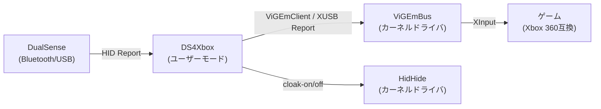
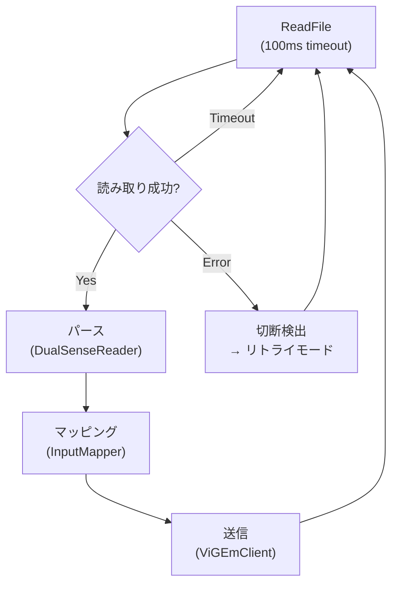

# DS4Xbox 技術仕様書

## 1. システム概要

DS4Xbox は、DualSense（PS5 コントローラー）から HID レポートを読み取り、Xbox 360 の XInput レポートに変換し、ViGEmBus 仮想デバイスに送信するリアルタイムパイプラインです。



## 2. 対象環境

| 項目 | 仕様 |
|---|---|
| OS | Windows 10 21H2 以降 / Windows 11 |
| ランタイム | .NET 8 LTS |
| ターゲットフレームワーク | `net8.0-windows` |
| コントローラー | Sony DualSense (Vendor ID: `0x054C`, Product ID: `0x0CE6`) |
| 接続方式 | Bluetooth（USB 有線も対応するが、Bluetooth 最適化） |

## 3. 外部依存

| 依存 | バージョン | ライセンス | 用途 |
|---|---|---|---|
| ViGEmBus | v1.22.0 | MIT | 仮想 Xbox 360 コントローラー生成 |
| HidHide | v1.4.x | GPLv3 | デバイス隠蔽（二重入力防止） |
| Nefarius.ViGEm.Client | 1.21.256 | MIT | ViGEmBus への公式ユーザーモードクライアント |

> [!NOTE]
> これらはカーネルドライバのため自作不可能です。Nefarius 氏の EV コード署名付き公式ビルドを使用します。

## 4. DualSense HID レポート仕様

### 4.1 デバイス識別

| 項目 | 値 |
|---|---|
| Vendor ID | `0x054C` (Sony) |
| Product ID | `0x0CE6` (DualSense) |

### 4.2 USB 入力レポート (Report ID: 0x01)

全長: **64 バイト**

| バイト | 内容 | 値の範囲 |
|---|---|---|
| 0 | Report ID | `0x01` |
| 1 | Left Stick X | 0–255 (center=128) |
| 2 | Left Stick Y | 0–255 (center=128) |
| 3 | Right Stick X | 0–255 (center=128) |
| 4 | Right Stick Y | 0–255 (center=128) |
| 5 | L2 Trigger | 0–255 |
| 6 | R2 Trigger | 0–255 |
| 7 | Sequence counter | — |
| 8 | Buttons 1 (ビットフィールド) | 下記参照 |
| 9 | Buttons 2 (ビットフィールド) | 下記参照 |
| 10 | Buttons 3 (ビットフィールド) | 下記参照 |

#### Byte 8: Buttons 1

| ビット | ボタン |
|---|---|
| Bit 0–3 | D-Pad (Hat Switch): 0=N, 1=NE, 2=E, 3=SE, 4=S, 5=SW, 6=W, 7=NW, 8=Released |
| Bit 4 | Square (□) |
| Bit 5 | Cross (✕) |
| Bit 6 | Circle (◯) |
| Bit 7 | Triangle (△) |

#### Byte 9: Buttons 2

| ビット | ボタン |
|---|---|
| Bit 0 | L1 |
| Bit 1 | R1 |
| Bit 2 | L2 (デジタル) |
| Bit 3 | R2 (デジタル) |
| Bit 4 | Create |
| Bit 5 | Options |
| Bit 6 | L3 |
| Bit 7 | R3 |

#### Byte 10: Buttons 3

| ビット | ボタン |
|---|---|
| Bit 0 | PS Button |
| Bit 1 | Touchpad Click |
| Bit 2 | Mute |

### 4.3 Bluetooth 入力レポート

| モード | Report ID | 説明 |
|---|---|---|
| 初期状態 | `0x01` | 簡易フォーマット |
| 拡張モード | `0x31` | ハンドシェイク後に切り替わる |

> [!IMPORTANT]
> 拡張モード（Report ID `0x31`）では、先頭に 2 バイトのヘッダが追加される以外は USB フォーマットと同じ構造です。パース時にオフセットの調整が必要です。

## 5. Xbox 360 XInput レポート仕様

### 5.1 XUSB_REPORT 構造体

#### wButtons（16 ビットのビットフィールド）

| 定数名 | 値 |
|---|---|
| `DPAD_UP` | `0x0001` |
| `DPAD_DOWN` | `0x0002` |
| `DPAD_LEFT` | `0x0004` |
| `DPAD_RIGHT` | `0x0008` |
| `START` | `0x0010` |
| `BACK` | `0x0020` |
| `LEFT_THUMB` | `0x0040` |
| `RIGHT_THUMB` | `0x0080` |
| `LEFT_SHOULDER` | `0x0100` |
| `RIGHT_SHOULDER` | `0x0200` |
| `GUIDE` | `0x0400` |
| `A` | `0x1000` |
| `B` | `0x2000` |
| `X` | `0x4000` |
| `Y` | `0x8000` |

#### 軸・トリガー

| フィールド | 型 | 範囲 |
|---|---|---|
| `bLeftTrigger` | byte | 0–255 |
| `bRightTrigger` | byte | 0–255 |
| `sThumbLX` | short | -32768 ~ 32767 |
| `sThumbLY` | short | -32768 ~ 32767 |
| `sThumbRX` | short | -32768 ~ 32767 |
| `sThumbRY` | short | -32768 ~ 32767 |

## 6. ボタンマッピング

| DualSense | Xbox 360 | 備考 |
|---|---|---|
| ✕ (Cross) | A | |
| ◯ (Circle) | B | |
| △ (Triangle) | Y | |
| □ (Square) | X | |
| L1 | Left Bumper (LB) | |
| R1 | Right Bumper (RB) | |
| L2 (analog) | Left Trigger (LT) | 0–255 そのまま |
| R2 (analog) | Right Trigger (RT) | 0–255 そのまま |
| L3 | Left Thumb | スティック押し込み |
| R3 | Right Thumb | スティック押し込み |
| Create | Back | |
| Options | Start | |
| PS Button | Guide | |
| Touchpad Click | Guide | PS Button と同じ扱い |
| Mute | (未割り当て) | |
| D-Pad | D-Pad | Hat Switch → 個別ビット変換 |

## 7. 軸変換

### スティック

| 項目 | DualSense | Xbox |
|---|---|---|
| データ型 | unsigned byte | signed short |
| 値の範囲 | 0–255 (center=128) | -32768 ~ 32767 |

**変換式:**

```
xbox_value = (ds_value - 128) * 257
```

**Y 軸の反転:**

DualSense は下方向が正、Xbox は上方向が正のため、Y 軸のみ反転が必要です：

```
xbox_y = -((ds_y - 128) * 257)
```

> [!WARNING]
> オーバーフロー防止のため、結果は必ず `-32768` ～ `32767` の範囲にクランプしてください。

### トリガー

| 項目 | DualSense | Xbox |
|---|---|---|
| データ型 | byte | byte |
| 値の範囲 | 0–255 | 0–255 |

変換不要（そのまま渡す）。

## 8. Hat Switch (D-Pad) 変換テーブル

| DualSense 値 | 方向 | Xbox DPAD ビット |
|---|---|---|
| 0 | N（上） | `UP` |
| 1 | NE（右上） | `UP + RIGHT` |
| 2 | E（右） | `RIGHT` |
| 3 | SE（右下） | `DOWN + RIGHT` |
| 4 | S（下） | `DOWN` |
| 5 | SW（左下） | `DOWN + LEFT` |
| 6 | W（左） | `LEFT` |
| 7 | NW（左上） | `UP + LEFT` |
| 8 | Released | （なし） |

## 9. ポーリング仕様

| 項目 | 仕様 |
|---|---|
| メインループ | 別スレッドで動作 |
| 読み取り方式 | Windows HID API の `ReadFile`（Overlapped I/O） |
| ViGEmBus 送信 | 公式 ViGEmClient 経由で入力読み取り直後に即座に送信（1 対 1 対応） |
| タイムアウト | `ReadFile` に 100ms のタイムアウトを設定 |

> [!NOTE]
> Overlapped I/O と 100ms タイムアウトを組み合わせることで、コントローラー切断時にスレッドがハングしない設計になっています。



## 10. 診断モード

`DS4Xbox.exe --diagnose` または `diagnose_gamepad.bat` は以下を順番に確認します。バッチから実行する場合は、必要に応じて UAC 昇格したうえで `--no-dialog` を付けてコンソールに結果を残し、最後に `pause` で利用者が内容を確認できるようにします。同じ内容を `diagnostic_result.txt` にも保存します。

| 項目 | 成功時 |
|---|---|
| ViGEmBus 接続 | `ViGEmBus opened` |
| 仮想 Xbox 360 作成 | `Virtual Xbox 360 controller created` |
| DualSense 検出 | `DualSense HID device found` |
| DualSense 読み取り | `DualSense input read` |
| ViGEmBus 入力送信 | `ViGEmClient SubmitReport succeeded` |

通常動作と診断の主経路は公式 ViGEmClient API です。送信に失敗した場合のみ、低レベル X360 submit IOCTL の候補も順番に試し、どの候補が成功または失敗したかを表示します。候補は Function `0x803`〜`0x806` とアクセスビット差分を含みます。

入力反映の最終確認は `open_game_controllers.bat` で Windows の `joy.cpl` を開き、`Controller (XBOX 360 For Windows)` のプロパティ画面で行います。

## 11. HidHide 排他制御

| 操作 | コマンド | 説明 |
|---|---|---|
| ON 時 | `HidHideCLI.exe --cloak-on` | DualSense をゲームから隠蔽 |
| OFF 時 | `HidHideCLI.exe --cloak-off` | 隠蔽解除 |
| ホワイトリスト | `HidHideCLI.exe --app-reg <path>` | 自アプリの実行パスを登録 |

> [!IMPORTANT]
> ホワイトリストに自アプリの実行パスを登録することで、HidHide が有効な状態でも自身のみが DualSense を読み取れるようにします。

## 12. 設定ファイル (appsettings.json)

```json
{
  "startEnabled": false
}
```

| キー | 型 | デフォルト | 説明 |
|---|---|---|---|
| `startEnabled` | bool | `false` | `true` の場合、アプリ起動時に自動的に変換 ON になる |

## 13. ドライバ自動セットアップ仕様

本アプリケーションは、実行に必要な前提ドライバが不足している場合に、公式の安全なバイナリを自動取得してセットアップを支援する機能を備えています。

| 項目 | 仕様 |
|---|---|
| 対象ドライバ | ViGEmBus (v1.22.0), HidHide (v1.4.186.0), Legacinator (v1.2.0) |
| ダウンロード方式 | `System.Net.Http.HttpClient` による非同期HTTPSダウンロード（リアルタイム進捗報告対応） |
| セキュリティ | TLS 1.2 / TLS 1.3 の暗号化通信を明示的に指定。GitHub公式リポジトリ（HTTPS）からの直接ダウンロード |
| インストール方式 | ダウンロード完了後、Windowsの `ProcessStartInfo` を用いて管理者権限（`runas`）でインストーラーを起動。UACによるEV署名検証を通過 |
| インストール検知 | ・**ViGEmBus**: デバイスインターフェースGUID `{96E42B22-F5E9-42F8-B043-ED0F932F014F}` の有無で判定<br>・**HidHide**: `C:\Program Files\Nefarius Software Solutions\HidHide\x64\HidHideCLI.exe` の実在判定 |
